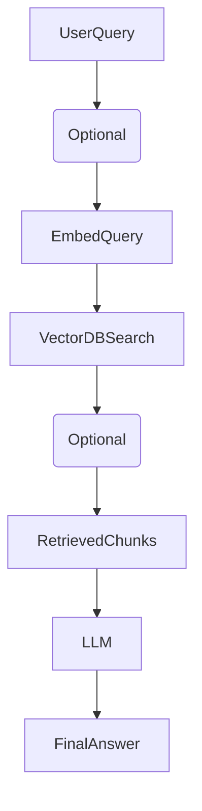

# AI & RAG Learning Resource

## 1. RAG Fundamentals (Retrieval Augmented Generation)

### ✅ What "Training" Means in RAG
In RAG, **you do NOT train the LLM** (like Llama 3.2). The LLM remains frozen.
"Training" in this context actually refers to optimizing your data pipeline:
1.  **Chunking**: Splitting documents intelligently.
2.  **Embedding**: Creating vector representations of those chunks.
3.  **Vector DB**: storing them efficiently.
4.  **Retrieval Logic**: Setting up search parameters.

### ❌ Why not fine-tune the LLM?
Most RAG systems keep the base LLM untouched because fine-tuning often leads to:
*   Increased hallucinations (making things up).
*   Loss of general reasoning abilities.
*   High costs and maintenance time.
*   "Catastrophic Forgetting" of previous knowledge.

## 2. The RAG Pipeline
**Standard Flow:**


**Advanced features to add:**
*   **Query Rewriting**: The LLM reformulates the user's question to be more search-friendly.
*   **Hybrid Retrieval**: Combining Semantic (Vector) search with Keyword (BM25/TF-IDF) search.
*   **Reranking**: Using a specialized high-accuracy model to re-score the top 20 results before sending the top 5 to the LLM.
grep -r "chunking" . to get the keywords.

## 3. Mathematical Foundations: Embeddings & Similarity

### Basic Concepts
*   **TF-IDF / BM25**: Keyword-based algorithms (counting frequency of words). Good for exact matches.
*   **Semantic Search**: Understanding the *meaning* behind words using Vector Embeddings.

### How Semantic Similarity Works
1.  **Input**: Sentences like "Dogs are allowed on Fridays" vs "Pets can come to work".
2.  **Vectorization**: The Embedding Model (e.g., `sentence-transformers/all-MiniLM-L6-v2`) converts text into a list of numbers (Vectors).
    *   *Example*: 384 dimensions (a list of 384 float numbers).
3.  **Comparison (Dot Product)**:
    We calculate similarity using the Dot Product formula:
    $$ \text{Similarity} = \frac{A \cdot B}{\|A\| \|B\|} $$
    *   **High Score (e.g., 0.85)**: Vectors point in same direction → Similar meaning.
    *   **Low Score (e.g., 0.12)**: Vectors are different → Unrelated.

```python
# Conceptual Python Code
from sentence_transformers import SentenceTransformer
import numpy as np

model = SentenceTransformer('all-MiniLM-L6-v2')
sentences = ["Dogs are allowed", "Pets can come", "Remote work policy"]

# Get 384-dimensional vectors
embeddings = model.encode(sentences) 

# Calculate similarity (Dot Product)
similarity = np.dot(embeddings[0], embeddings[1]) 
print(f"Similarity: {similarity}") # High score for Dog vs Pet
```

## 4. Vector Databases

### Why do we need them? (The Scale Problem)
If you have 5,000 documents × 384 dimensions = **1,920,000 numbers**.
Comparing a query against every single document (Brute Force) is too slow.

**Vector DBs** solve this using **Indexing Algorithms**:
*   **HNSW (Hierarchical Navigable Small World)**: A graph-based algorithm. Very fast, high recall. Most popular.
*   **IVF (Inverted File Index)**: Divides vectors into clusters. Search only the relevant cluster.
*   **LSH (Locality Sensitive Hashing)**:Hashes similar items into same buckets.

### Popular Vector Databases
| Database | Type | Use Case |
| :--- | :--- | :--- |
| **Chroma** | Open Source / Local | Good for prototyping, local apps, and small-medium datasets. Simple setup. |
| **Pinecone** | Managed Cloud | Scalable, fully managed. Good for production if you don't want to manage infra. |
| **Weaviate** | Semantic Search Engine | Features hybrid search and modules out-of-the-box. |
| **Milvus / Qdrant** | Scalable Servers | High performance for massive datasets. |

### Chroma Workflow
1.  **Setup**: Create a persistent client.
2.  **Create Collection**: Like a table in SQL.
3.  **Add**: Insert Documents + Embeddings + Metadata.
4.  **Query**: Search by vector or text.
5.  **Manage**: Update/Delete items or collections.

## 5. The AI Landscape

### Machine Learning Tasks
| Domain | Tasks |
| :--- | :--- |
| **Computer Vision** | • Image Classification<br>• Object Detection<br>• Image Segmentation<br>• Depth Estimation<br>• Text-to-Image / Video<br>• Mask Generation |
| **Natural Language Processing (NLP)** | • Text Classification<br>• Token Classification<br>• Question Answering<br>• Summarization<br>• Text Generation (LLMs)<br>• Sentence Similarity |
| **Audio** | • Text-to-Speech (TTS)<br>• Automatic Speech Recognition (ASR)<br>• Audio Classification |

## 6. Comprehensive AI Glossary

| Term | Definition |
| :--- | :--- |
| **Large Language Models (LLMs)** | Neural networks trained to predict the next term in an input sequence. |
| **Tokenization** | The process of breaking down input text into discrete tokens (words/sub-words) for processing. |
| **Vectorization** | Converting words into coordinates in an n-dimensional space to represent meaning (Embeddings). |
| **Attention** | Mechanism allowing LLMs to understand context by relating ambiguous words to nearby words. |
| **Self-Supervised Learning** | Training method where models learn from data structure without explicit human labels. |
| **Transformer** | Algorithm using attention blocks to process input tokens and predict the next token. |
| **Fine-tuning** | Training a base LLM on specific Q&A pairs to specialize it for a domain. |
| **Few-shot Prompting** | Giving the LLM examples within the prompt to improve its response quality. |
| **RAG** | Retrieval Augmented Generation: Sending retrieved active documents with a query to the LLM. |
| **Vector Database** | Database optimized to store and retrieve content based on semantic similarity. |
| **Model Context Protocol (MCP)** | Std protocol for LLMs to connect with external tools/databases. |
| **Context Engineering** | optimizing the information given to the LLM (Prompting, RAG, history). |
| **Agents** | AI systems that can use tools and perform multi-step actions to solve problems. |
| **Reinforcement Learning (RL)** | Training models via feedback (positive/negative scores) to encourage specific behaviors. |
| **Chain of Thought** | Prompting technique encouraging the model to "show its work" step-by-step. |
| **Reasoning Models (LRMs)** | Models trained specifically to solve complex problems via multi-step reasoning. |
| **Multi-modal Models** | Models that can process text, images, video, and audio simultaneously. |
| **Small Language Models (SLMs)** | Compact models with fewer parameters, faster and cheaper, good for specific tasks. |
| **Distillation** | Training a small student model to mimic the output of a large teacher model. |
| **Quantization** | Compressing a model (e.g., 32-bit to 8-bit) to reduce memory usage and increase speed. |

## 7. Advanced Chunking Strategies

Choosing the right chunking strategy is critical for retrieval quality.

| Strategy | Usage | Best For |
| :--- | :--- | :--- |
| **Fixed-size Chunking** | 75% of cases | General purpose. Simple to implement (e.g., 500 chars). |
| **Sentence Based** | 75% of cases | Preserves grammatical structure. Good for NLP tasks. |
| **Paragraph Based** | 75% of cases | Keeps full context of ideas. Good for summarization. |
| **Semantic Chunking** | 75% of cases | Splits based on meaning changes (using embeddings). High accuracy. |
| **Agentic Chunking** | 75% of cases | LLM decides where to split. Slow but very high quality. |
| **Overlap Chunking** | Always used (25%) | Keeps context between chunks. Standard is 50-100 chars overlap. |

### Chunking Best Practices
*   **Size**: 200-500 characters is a good starting point.
*   **Overlap**: 50-100 characters to prevent cutting sentences in half.
*   **Boundaries**: Split at sentence endings (`.`, `?`, `!`). Avoid mid-word breaks.
*   **Validation**: Always test search results with real queries to verify context isn't lost.

### Tools for Chunking
*   **LangChain**: Uses `RecursiveCharacterTextSplitter`. Handles separators/overlap automatically.
*   **spaCy**: Uses `SpacyTextSplitter`. Linguistically aware (knows what a "sentence" really is).

## 8. Production Engineering & Reliability

Moving from prototype to production requires handling failures and optimizing performance.

### Caching Architecture
Use **Redis** to cache generic queries and embeddings to save cost and latency.
*   **Query Cache**: "What is the refund policy?" -> Returns cached answer immediately.
*   **Embedding Cache**: Hash of input text -> Returns cached vector (saves GPU time).

### Resilience Pattern (Pseudo-code)
Always have fallbacks if the primary vector search fails.

```python
def robust_retrieval(query):
    try:
        # 1. Primary: Full Semantic Search
        return rag_pipeline(query)
    except VectorDBError:
        # 2. Fallback: Keyword Search (BM25)
        print("Vector DB down, using keywords")
        return keyword_search(query)
    except LLMError:
        # 3. Fallback: Just return documents
        print("LLM down, returning raw chunks")
        return format_retrieved_chunks(query)
    except Exception:
        # 4. Final: Graceful degradation
        return "Service temporarily unavailable. Please try again later."
```

### Monitoring Checklist
*   **Latency**: Track p95 response times.
*   **Rate Limiting**: Protect your LLM API quota.
*   **Error Rates**: Monitor timeout/connection errors.
*   **Logging**: Log user queries (without PII) to improve data quality later.

## 9. Future Frontiers in RAG

| Concept | Description |
| :--- | :--- |
| **Multi-Modal RAG** | Retrieving Images, Audio, and Video alongside text. |
| **Graph RAG** | Using Knowledge Graphs to relationships (Entity A -> related to -> Entity B). |
| **Hybrid Search** | The gold standard: Semantic (Vector) + Keyword (BM25) search combined. |
| **Agentic RAG** | AI Agents that plan *how* to search (e.g., "Search wiki first, then search email"). |
| **Federated RAG** | Retrieving knowledge from multiple isolated domains/companies. |
| **Reranking** | Using a cross-encoder to re-sort results. High accuracy boost. |
| **Query Expansion** | Generated synonyms/related questions to broaden search coverage. |
| **RAFT** | (Retrieval Augmented Fine-Tuning): Training the LLM specifically to be good at RAG tasks. |